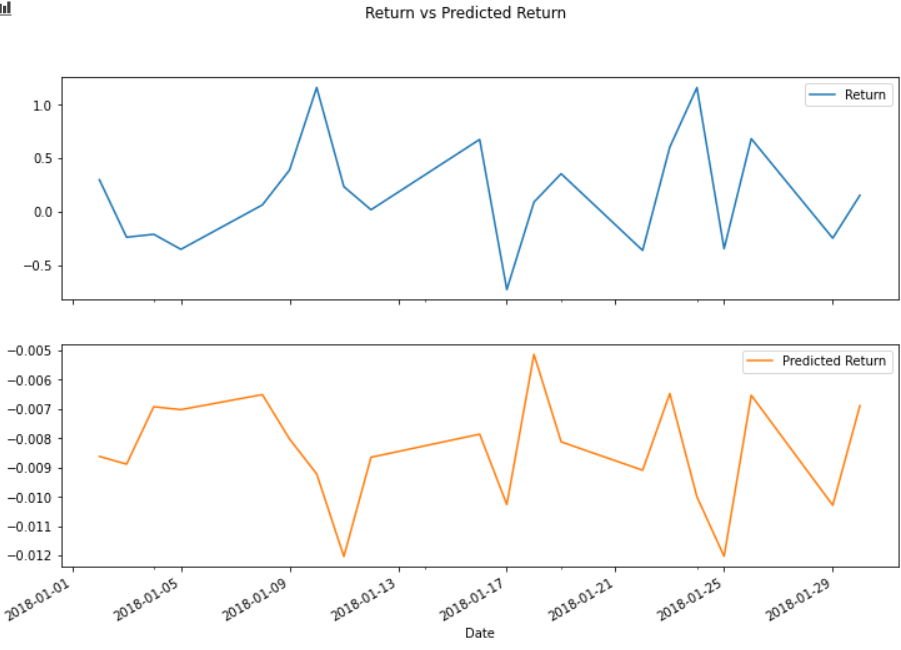
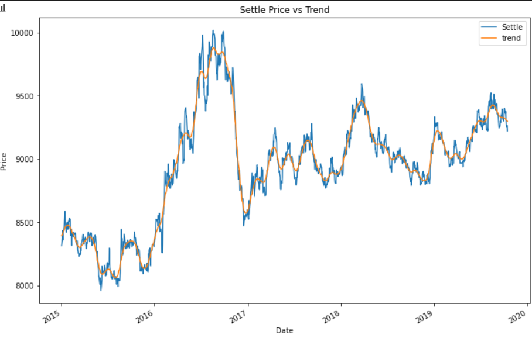
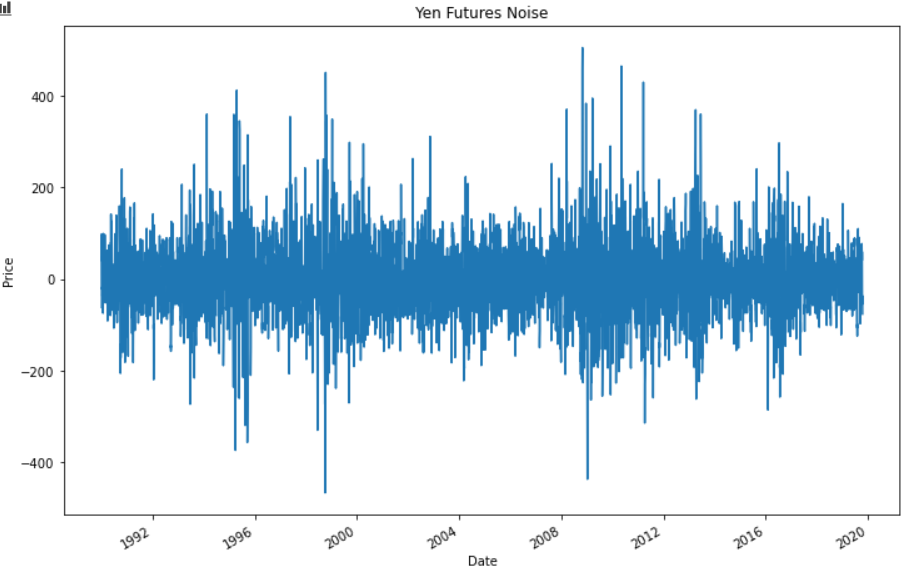

# A Yen For The Future
This project is to test our understanding of the many time-series tools learned in order to predict future movements in the value of the Japanese yen versus the U.S. dollar.[1]

---

## Table of contents
* [General info](#general-info)
* [Screenshots](#screenshots)
* [Technologies](#technologies)
* [Installation Guide](#installation-guide)
* [Code Examples](#code-examples)
* [Usage](#usage)
* [Sources](#sources)
* [Status](#status)
* [Contributors](#contributors)

---

## General Information

Financial departments of large companies and hedge funds are always looking for an edge to deal with foreign currency transactions while doing international business, so any information assisting to forecast the future direction and risk of currencies is helpful.  The following project lays the foundation for time-series and regression analysis to help aid in this task.[1]

---

## Screenshots

* Regression Analysis

* 

---

## Technologies

* Python - Version 3.8.5
* VS Code - Version 1.49.1
* Jupyter Notebook - Version 6.1.1
* Windows 10
* Path - Version 15.0.0
* Pandas - Version 1.1.3
* Numpy - Version 1.19.2
* Statsmodel - Version 0.12.0
* Scikit-learn - Version 0.23.2

---

## Installation Guide

1. Download the entire repository, a_yen_for_the_future
2. Open Git Terminal
3. Navigate into the repository file path where you stored the files during the download.
4. The notebook files, time_series_analysis.ipynb and regression_analysis.ipynb, should be visible and ready to run.

*See the [Usage](#usage) section below for instructions on how to run the dashboard.

---

## Code Examples

* Hodrick Prescott Filter

``` python
ts_noise, ts_trend = sm.tsa.filters.hpfilter(yen_futures["Settle"])
```

* 

* 

* GARCH Model

``` python
# "Model"
garch_model = arch.arch_model(returns, mean='Zero', vol='GARCH', p=2, q=1)

# "Fit" the model
garch_response = garch_model.fit(disp='off')

# Last day of the dataset
last_day = returns.index.max().strftime('%Y-%m-%d')

# Create a 5 day forecast of volatility
forecast_horizon = 5

# Start the forecast using the last_day calculated above
forecasts = garch_response.forecast(start=last_day, horizon=forecast_horizon)
```

---

## Usage

1. To run the analysis process, navigate to the directory where time_series_analysis.ipynb is located using Git Terminal within the directory a_yen_for_the_future.

2. Execute the command 'code .' in the terminal to open VS Code.

3. VS Code opens.  Select the time_series_analysis.ipynb file found in the left side navigation pane.

4. Click the Run All Cells button, double arrows, found at the top of the main workspace to run all cells in the Jupyter Notebook file.

5. All cells in the notbook run.

* Follow steps 1 - 5 to run the regression_analysis.ipynb notebook.

---

## Sources

- [1] https://rice.bootcampcontent.com/Rice-Coding-Bootcamp/rice-hou-fin-pt-09-2020-u-c/tree/master/hw/10-Time-Series/Instructions

---

## Status

Project is: _finished_

---

## Contributors

* Jonathan Owens
* LinkedIn: www.linkedin.com/in/jonowens
